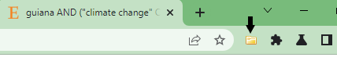
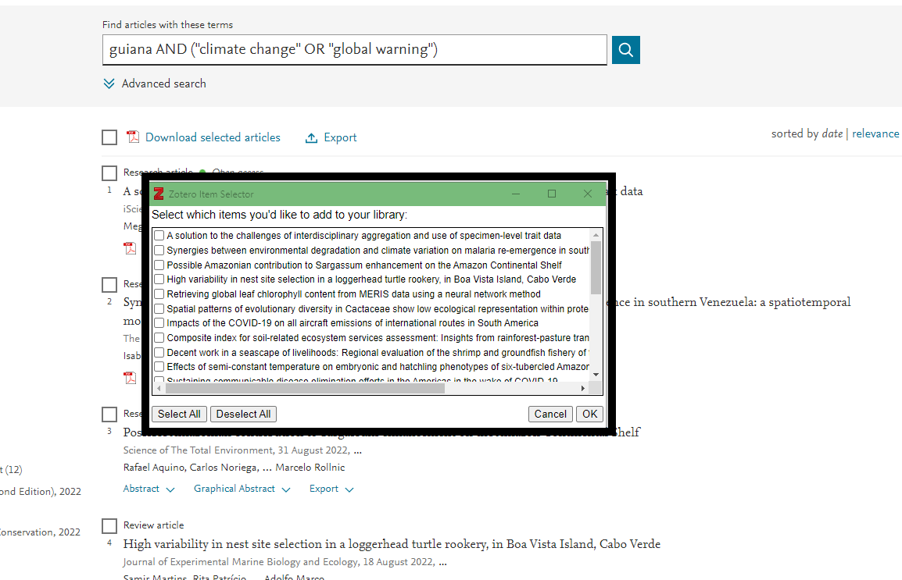

# Base de données bibliographique

Création d'une api pour accéder à des documents bibliographiques

## 🏠 [Homepage](https://solamazon.com/data-base)

## ✨ [Demo](https://nicolarson.github.io/periclim/)

## Prérequis

- Installer [Zotero + Connecteur chrome](https://www.zotero.org/download/)
  - [Guide d'utilisation](https://www.zotero.org/support/quick_start_guide)
  Logiciel de gestion bibliographiques
- Avoir un compte [Heroku](https://www.heroku.com/)
- Installer [NodeJS](https://nodejs.org/fr/)
<!-- - NPM -->

## Création d'une base de données noSQL (JSON)

### Rechercher du contenus

- Ouvrir le logiciel Zotero
- Sur [sciencedirect.com](https://www.sciencedirect.com/)
- Se connecter via le courriel institutionnel.
- Utiliser les mots clés de recherche `guiana AND ("climate change" OR "global warning")`.
- Cliquez sur l’icône du connecteur Zotero


- Une fenêtre apparaît
- 
- Sélectionner les documents désirés puis cliquez sur OK
- Les documents seront insérer dans le logiciel
- > Vous pouvez supprimer les doublons via la fonction doublon du logiciel mais ce n'ai pas nécessaire

### Exporter la bibliographie en CSV

Dans `fichier` cliquez sur `Exporter la bibliothèque...`
Sélectionnez le format CSV puis enregistrez le dans le dossier `convert-csv-to-json`.

### Convertir le fichier CSV en JSON

Allez dans le dossier `convert-csv-to-json`.
Puis lancez la commande

```bash
node app.js 
```

L'application créera un fichier JSON nommé db puis la date de création, contenant notre base de données bibliographique.

Nous allons déployer en utilisant Heroku

## Creation d'une API open source

- Créer un compte [Heroku](https://www.heroku.com/)

Initialiser un projet car nous allons utiliser un peut de back end afin de pouvoir utiliser notre fichier json.

```bash
npm init
```

Vous pouvez remplir ou non les informations demandés

Installez un serveur json pour que Heroku sache de quoi nous avons besoin

```bash
npm i json-server
```

Nous allons ajouter la ligne `"start": "node server.js"` dans le fichier package.json.

```json
// ...
  "main": "index.js",
  "scripts": {
    "test": "echo \"Error: no test specified\" && exit 1",
    "start": "node server.js"
  },
// ...
```

Nous allons créer le fichier `server.js` pour utiliser notre server.

```js
const jsonServer = require('json-server');
const server = jsonServer.create();
const router = jsonServer.router('db.json');
const middlewares = jsonServer.defaults();
const port = process.env.PORT || 3000;

server.use(middlewares);
server.use(router);
server.listen(port, () => {
    console.log('JSON Server is running');
});
```

Copier le fichier du dossier `./convert-csv-to-json/output` dans `./bibliographie-api` et renommez le en `db.json`.

## HEROKU

Vous êtes inscrit chez Heroku.
Installez l'[interface de ligne de commande d'Heroku](https://devcenter.heroku.com/articles/heroku-cli).

```bash
npm install -g heroku
```

### Créer notre API

```npm
npx heroku create bibliographie-api
```

Une fenetre pour autentification va apparaitre.
Identifiez vous.

On peut maintenant pousser notre api chez Heroku.
```bash
git push heroku main
```
## Installation

```sh
git push heroku main
```

## Mise à jour

## Auteur

👤 **Nicolas Yang**

- Website: nicolasyang.dev
- Github: [@nicolarson](https://github.com/nicolarson)
- LinkedIn: [@nicolas-yang-dev](https://linkedin.com/in/nicolas-yang-dev)
